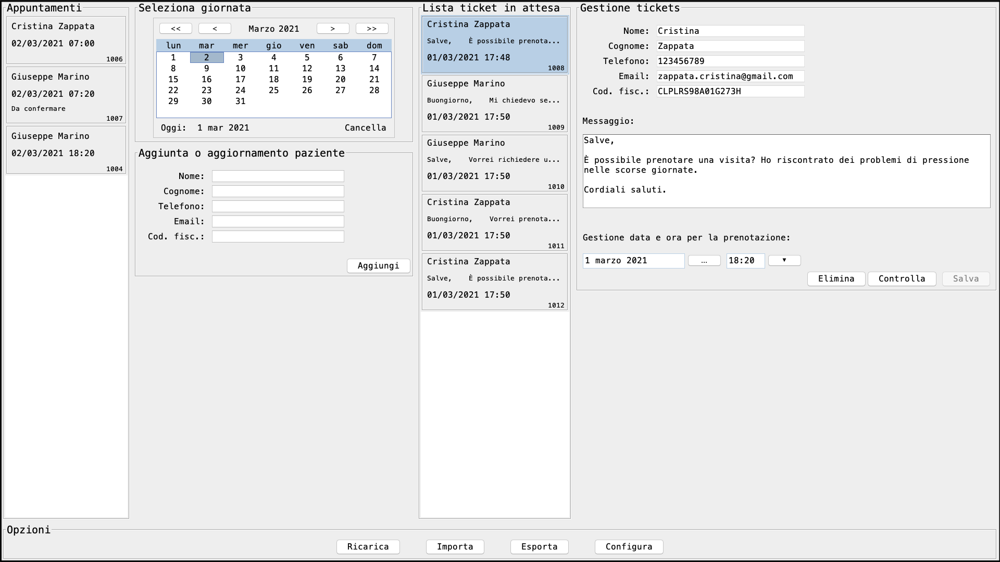
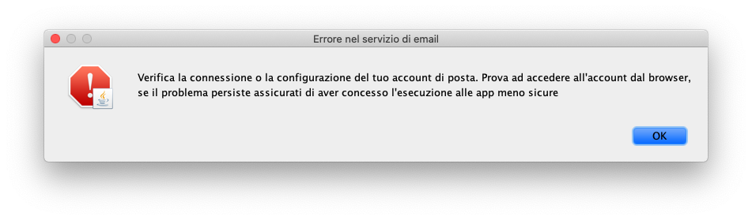
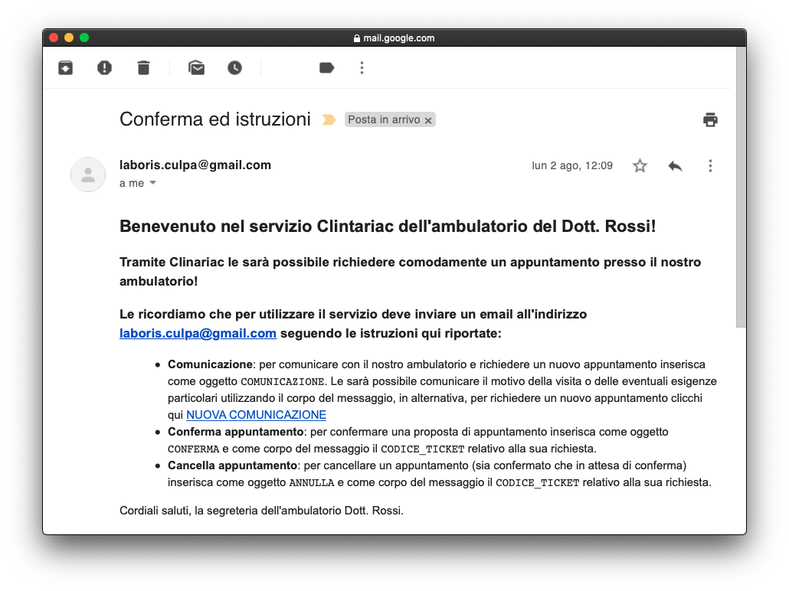
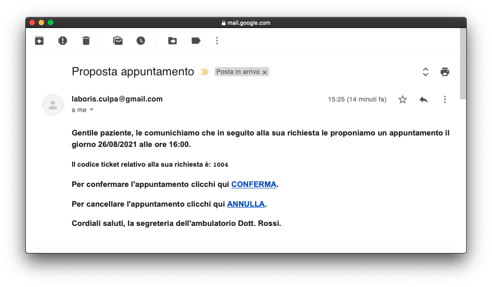
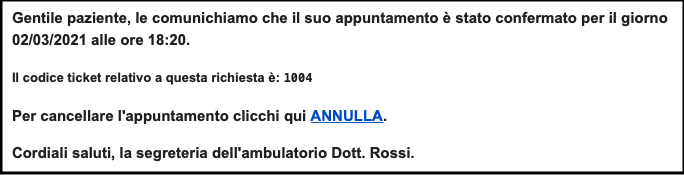
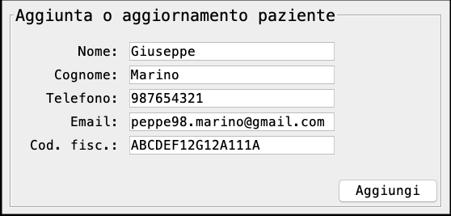

\newpage

# Introduzione

Clintariac è un applicativo pensato per semplificare il lavoro del personale di segreteria negli ambulatori medici, con un occhio di riguardo anche ai pazienti, evitando inutili e lunghe attese. La sua funzione principale è quella di gestire gli appuntamenti in maniera assistita, integrando un'agenda elettronica. Il fulcro della sua implementazione sono le comunicazioni via email, di fatto il software funge da client di posta elettronica, le richieste da parte dei pazienti nascono da delle email opportunamente formattate, le risposte sono anch'esse delle email, processate in automatico sulla base della compilazione della segreteria.

Le interminabili attese presso il proprio medico di base potrebbero essere facilmente evitate, a patto che il personale dell'ambulatorio sia disposto a concordare gli appuntamenti tramite le tradizionali vie di comunicazione. Effettivamente, oggi, ciò è diventato la normalità, per scongiurare gli assembramenti nelle sale d'attesa, ma la richiesta di appuntamento risulta sempre dispendiosa in termini di tempo. 

Escludendo un'infrastruttura con una copertura nazionale, come ad esempio un portale predisposto dal Ministero della Salute, resta ben poco di efficace per venire incontro a queste esigenze.

Si potrebbe pensare, ad esempio, ad un applicativo per dispositivi mobili o ad un sito web. Molti ambulatori potrebbero escludere simili soluzioni, per via del relativamente basso numero di utenti, e gli elevati costi per sviluppare ad hoc e mantenere il tutto.

Configurando la propria installazione di Clintariac con il proprio account di posta elettronica, il servizio può essere reso operativo all'istante e senza sostenere costi elevati. D'altro canto, le email sono alla portata di quasi tutti i pazienti, idealmente chiunque abbia un account di posta elettronica può interagire con il servizio.

\clearpage

# Diagrammi dei casi d'uso

Qui di seguito vengono riportati i diagrammi con i casi d'uso individuati, naturalmente il tutto è il frutto delle nostre riflessioni, alla luce delle nostre esperienze. Non abbiamo avuto modo di relazionarci direttamente con un medico, ragione per cui sono da intendere come casi d'uso indicativi.

La stesura dei casi d'uso permette di raccogliere in maniera esaustiva e non ambigua i requisiti del software. Una volta individuati e valutati quest'ultimi, il focus cade sulle modalità di interazione tra gli attori e il sistema, dove gli attori individuati sono gli utenti (gli assistiti registrati al servizio) e la segreteria (il personale che ha accesso al sistema). Questi casi d'uso sono rappresentati con dei diagrammi in UML, segue ad essi una descrizione degli scenari elementari di utilizzo del sistema individuati.  

\vspace{24pt}

## Gestione dei ticket

La parte fondamentale del sistema è quella della gestione dei ticket, dove con il termine ticket ci riferiamo, in senso lato, ad una richiesta di prenotazione, o ad una prenotazione. Questa risulta essere il nucleo del sistema in quanto permette di realizzare quanto desideriamo dal software.

{width=80%}

\vspace{12pt}


### Richiesta nuova prenotazione

**Attori**: Utente.

**Descrizione**: Quando un utente desidera richiedere un appuntamento deve poter comunicare la sua intenzione, e deve quindi poter inviare un'email verso il sistema. Potrebbe essere necessario comunicare qualche informazione particolare, ad esempio per stabilire l'appuntamento in una particolare data.

\vspace{12pt}


### Visualizza e processa richieste

**Attori**: Segreteria.

**Descrizione**: Il compito della segreteria è quello di poter visualizzare tutte le richieste in attesa di essere processate, e quindi deve avere modo di consultare la lista dei ticket in attesa, con i relativi dettagli.

\vspace{12pt}


### Conferma richiesta

**Attori**: Segreteria.

**Descrizione**: Una volta selezionata una richiesta tra quelle in attesa, la segreteria deve poter selezionare una data ed un'ora da proporre all'utente, ed infine avvertirlo via email.

\vspace{12pt}


### Conferma prenotazione.

**Attori**: Utente.

**Descrizione**: Una volta ricevuta la proposta per un appuntamento l'utente deve poter confermare la sua disponibilità per la data e l'ora proposta, inviando sempre un messaggio di conferma.

\vspace{12pt}


### Annulla prenotazione.

**Attori**: Utente.

**Descrizione**: Qualora l'utente non abbia più bisogno di assistenza o la data e l'ora proposte non fossero consone ai propri impegni, egli deve poter annullare la richiesta, ed eventualmente richiederne un'altra.

\vspace{12pt}


### Visualizza gli appuntamenti per una giornata

**Attori**: Segreteria.

**Descrizione**: La segreteria deve avere accesso all'agenda virtuale, con tutti gli appuntamenti fissati in un dato giorno, sia per poter verificare la disponibilità, sia per altri motivi organizzativi interni.

\vspace{12pt}


### Elimina prenotazione.

**Attori**: Segreteria.

**Descrizione**: La segreteria deve avere la possibilità di cancellare gli ticket, se ad esempio il medico dovesse avere dei contrattempi di varia natura.

\clearpage


## Gestione paziente

È necessario pensare a come registrare gli utenti, per fare in modo che il sistema processi solo le richieste provenienti da utenti registrati. I motivi di questa scelta possono essere principalmente legati alla sicurezza e al contenimento dello spam. Lo scenario di registrazione previsto è quello dove l'utente, recatosi fisicamente in ambulatorio, prende visione del servizio, e chiede al personale di segreteria di caricare il suo profilo nel sistema.

{width=80%}

\vspace{12pt}


### Inserisci paziente

**Attori**: Segreteria.

**Descrizione**: Il sistema deve permettere di registrare un utente, caricando i suoi dati anagrafici ed i suoi recapiti.

\vspace{12pt}


### Aggiorna paziente

**Attori**: Segreteria.

**Descrizione**: Deve essere possibile, inoltre, aggiornare il profilo di un utente già registrato, nell'eventualità che siano stati fatti degli errori, o il paziente abbia cambiato recapiti.

\newpage


# Analisi dei requisiti

Nelle fasi preliminari allo sviluppo del software sono stati discussi, analizzati e definiti una serie di requisiti, i quali hanno definito le funzionalità che il prodotto software avrebbe dovuto offrire. Da questa analisi, concordemente alle intenzioni preliminari, sono stati identificati diversi requisiti funzionali e non funzionali.

## Requisiti funzionali

I requisiti funzionali comprendono tutte le interazioni tra il software e la sua utenza, in questo caso sono stati delineati i seguenti:

- Visualizzare gli appuntamenti per la giornata selezionata nel calendario.
- Registrare, aggiornare o cancellare i dati di un paziente, controllando che i campi siano inseriti correttamente.
- Visualizzare la lista delle nuove richieste (ticket in attesa), non ancora processate.
- Visualizzare i dettagli di una richiesta, con il messaggio ricavato dall'email.
- Calcolare e proporre il primo appuntamento utile, da assegnare eventualmente ad un ticket.
- Impostare data e ora specifici al momento della processazione, per soddisfare le esigenze particolari dei pazienti o dei medici.
- Controllare se per una data immessa sia possibile aggiungere un appuntamento.
- Confermare o cancellare il ticket in attesa.
- Permettere agli assistiti di richiedere un appuntamento.
- Inviare un messaggio al paziente con la proposta della prenotazione, appena il ticket viene inserito in agenda.
- Cancellare il ticket con comunicazione all'utente in caso di mancata conferma entro un determinato arco temporale.
- Aggiornare lo stato del ticket in caso di conferma da parte del paziente.
- Inviare messaggio di errore al paziente in caso di richiesta mal formattata.

## Requisiti non funzionali

I requisiti non funzionali comprendono i vincoli, le proprietà e le caratteristiche relative al software, in questo caso sono stati delineati i seguenti:

- Utilizzo del linguaggio Java, utilizzando le librerie grafiche AWT e Swing, mediante MVC.
- Unica dashboard principale, da dove sia possibile visualizzare contemporaneamente gli appuntamenti e i ticket da processare.
- Implementazione di un servizio per la gestione persistente dei dati, mediante scrittura su disco.
- Implementazione di un client di posta elettronica per l'invio e la ricezione delle email.
- Implementazione di un servizio di coordinazione tra, email, dati su disco e dati inseriti dalla GUI.
- Rappresentazione e memorizzazione interna dei dati usando il formato JSON.
- Aggiornamento periodico dello stato dell'applicativo, con pull delle email, verifica di prenotazioni scadute etc.
- Processazione delle richieste per i soli utenti registrati.
- Suddivisione modulare delle operazioni in diverse funzioni e classi.

# Descrizione del Software

Dai requisiti precedentemente discussi hanno preso forma la logica dell'applicativo, la sua interfaccia grafica, così come tutta una serie di componenti software utili all'implementazione dei servizi richiesti. Per descrivere il software è bene delineare quali saranno, nel concreto, le interazioni possibili con esso, descrivendo il funzionamento di ogni aspetto.

## Interazioni

Le interazioni con Clintariac possono essere di due tipi, da una parte abbiamo le interazioni dei pazienti, che scaturiscono dall'invio di email, dall'altra parte abbiamo le interazioni effettuate dalla segreteria sulla dashboard del servizio. Qui di seguito è proposto un diagramma intuitivo di quelle che possono essere le operazioni messe a disposizione degli utilizzatori del servizio.


Il punto di partenza sono gli utenti registrati che inviano le richieste, sotto forma di email formattate secondo le istruzioni, all'indirizzo di email impiegato nella configurazione del servizio. Se una email non risultasse scritta in una delle modalità attese dal servizio, l'utente verrà notificato da una risposta automatica, un discorso analogo avviene qualora l'utente non fosse registrato. Per gli utenti registrati, Clintariac esegue la processazione.

A questo punto gli scenari sono diversi, e sono specificati nel diagramma. Per sommi capi, può essere creato o modificato un ticket. Questo è da intendersi come l'entità associata alla richiesta di appuntamento, e successivamente all'appuntamento fissato. A ciascun ticket è associato un identificativo, esso è comunicato al paziente in seguito alla proposta per appuntamento, e dovrà essere specificato in tutte le interazioni future legate a quella richiesta.

Ad una proposta di appuntamento ne può seguire la conferma o la cancellazione da parte dell'utente. Queste vengono sempre effettuate inviando delle email nel formato atteso da Clintariac, specificando l'identificativo del ticket.

È bene sottolineare che una volta proposto un appuntamento, lo slot temporale è da considerarsi occupato nonostante non ci sia la conferma da parte del cliente, per evitare di concedere per errore uno stesso slot a più appuntamenti. Questo porta un problema, ossia, un utente potrebbe non prendere nota della proposta e lo slot resterebbe occupato inutilmente. Per evitare ciò ogni proposta ha una finestra temporale all'interno della quale essa può essere confermata, oltre questo termine temporale la richiesta viene cancellata automaticamente dal sistema.

La segreteria si riserva la possibilità di eliminare un appuntamento in qualsiasi momento, a ciò segue l'invio di un messaggio al paziente, che lo notifichi e lo inviti a richiedere un nuovo appuntamento in una data futura.

Per assistere l'utente nella fase di richiesta, conferma e annullamento, a partire dall'email con le istruzioni, sono integrati dei collegamenti ipertestuali per compilare in maniera automatica, o semi assistita, le email nel formato atteso.

### Gli stati di un ticket

Alla luce di ciò, ad un ticket può essere associato uno stato:

- appena ricevuta la richiesta, il ticket viene creato in stato di *attesa di elaborazione*, affinché esso sia processato da parte della segreteria.
- in seguito all'avvenuta proposta di appuntamento, e quindi dopo la processazione da parte della segreteria, il ticket passa in stato di *attesa di conferma*. 
- non appena l'utente avrà confermato la proposta, il ticket passerà in stato *confermato* e verrà trattato come un appuntamento fissato in agenda.
- un ticket potrebbe passare in stato *eliminato*, tuttavia, data la natura non particolarmente fiscale degli appuntamenti così presi, abbiamo pensato di eliminare semplicemente i ticket non più utili.

## Dashboard

All'avvio di Clintariac viene mostrata la finestra principale che costituisce la dashboard. Per venire incontro alle necessità del sistema, abbiamo fatto in modo che in una sola schermata potesse essere rappresentato tutto l'occorrente per la segreteria. 
Quindi da una parte abbiamo disposto l'occorrente per la fruizione dell'agenda giornaliera, dall'altra parte abbiamo inserito l'occorrente per prendere visione ed elaborare le richieste pendenti.

Abbiamo la sezione più a sinistra che permette di visualizzare gli appuntamenti per un determinato giorno, il quale può essere scelto dall'apposito selettore a lato. La lista centrale contiene i ticket in attesa di essere processati, e la sezione più a destra è pensata per la gestione e visualizzazione dei ticket. Infine, è presente una sezione per la gestione degli utenti.

{width=100%}

### Agenda

La parte per l'agenda è abbastanza semplice ed intuitiva, consente di visualizzare tutti gli appuntamenti per una data fissata, in ordine cronologico. Il selettore del calendario permette di selezionare una qualsiasi giornata a partire dal giorno corrente, in modo da caricare a lato la lista degli appuntamenti. Per ciascuno di essi vengono indicati data, ora, identificativo, ed eventualmente stato. Una volta selezionato un appuntamento da questa lista esso può essere eliminato. In seguito all'eliminazione, il paziente viene notificato tramite email dell'avvenuta cancellazione. Si nota che questa agenda tiene traccia solo degli appuntamenti non cancellati, infatti non compariranno in alcun modo qualora siano stati eliminati dalla segreteria o dai pazienti.

### Richieste

Sempre nella dashboard è presente un'altra lista che contiene tutte le richieste di appuntamenti. Accanto ad essa è presente un pannello che mostra i dettagli per la richiesta selezionata, sempre da questo è possibile completare i dettagli per l'appuntamento selezionando una data e un'ora. Se lo slot temporale risultasse libero, il personale di segreteria potrebbe procedere con la proposta di appuntamento.

La segreteria può cancellare una qualsiasi richiesta, in un qualsiasi suo stato, selezionando, il ticket da una delle due liste e cliccando sul bottone di elimina, per poi confermare nella dialog seguente.

Tutte le interazioni che possono provocare un'alterazione dei ticket dal lato della segreteria, sono precedute o seguite da delle finestre di dialog, che possano informare circa eventuali errori, conflitti, o l'avvenuta modifica con successo del ticket.

### Gestione paziente

Come già discusso, per restare nell'ottica dei casi d'uso del software, e per mantenere l'infrastruttura quanto più snella possibile, la registrazione di un paziente è gestita dalla segreteria. Visto che si tratta di una funzione utilizzata meno frequentemente rispetto alle altre discusse, abbiamo pensato di mantenere il form di registrazione nella dashboard, non sono presenti altre funzionalità tali da giustificare un'altra schermata. Inoltre, sempre sfruttando la stessa sezione si ha la possibilità di aggiornare i dati dei pazienti già registrati.

## Backend

### MVC

Tra i requisiti abbiamo la separazione tra la logica dell'applicazione e l'interfaccia grafica, per fare ciò abbiamo utilizzato il MVC. Lo abbiamo utilizzato in una sua variante piuttosto atomica, ma rende bene l'idea della separazione tra la logica di presentazione dei dati dalla logica di business. Il design model-view-controller divide l'applicazione in questi componenti, e ne definisce le modalità di interazioni tra loro. 

I *model* costituiscono le strutture dati dell'applicazione, indipendente dall'interfaccia utente, gestiscono direttamente i dati, la logica e le regole dell'applicazione. Essi sono responsabili della gestione dei dati dell'applicazione, ricevuti dal controller.

Le *view* sono la rappresentazione visuale delle informazioni, sono le modalità per rappresentare il modello in termini di campi di testo, etichette, bottoni e così via, e costituiscono l'interfaccia grafica presentata all'utente.

I *controller* si occupano di controllare gli input e convertirli in comandi per i corrispondenti model o view. Essi rispondono agli input dell'utente ed eseguono le interazioni sugli oggetti dei model. Ogni controller riceve un input dalla view, opzionalmente lo convalida e poi lo passa al model, così come aggiorna la view in caso di aggiornamento del model.

Abbiamo applicato questo pattern di software design in un modo poco canonico, in quanto abbiamo definito un albero di componenti grafiche, ognuna delle quali ha i propri model, view e controller. Così abbiamo circoscritto le responsabilità, e abbiamo fatto in modo che ogni componente esponga solo le funzionalità che effettivamente dovrebbero essere fornite all'esterno. Nella pratica ognuna di queste componenti è rappresentata dal suo controller, in quanto esso incapsula al suo interno il model e la view.

### Data Management

Le operazioni effettuate all'interno del software sono persistenti. Infatti al primo avvio di Clintariac vengono creati due file, essi sono dei documenti in formato JSON, dentro i quali sono memorizzati gli utenti registrati al sistema ed i ticket. Da questo punto in avanti, ad ogni avvio, essi saranno caricati in memoria, e ad ogni modifica segue una scrittura sul file.

Tutti questi aspetti sono delegati al `DataManager`, esso è concretizzato in un oggetto che espone i metodi necessari per lavorare con la lista dei pazienti registrati e per lavorare con i ticket. Permette quindi di caricare i dati, mantenerli in memoria, modificarli e di scriverli sul disco. 

### Email Management

Come già discusso, Clintariac ha bisogno di collegarsi ad un server di posta elettronica, attualmente è predisposto per operare con le sole caselle di posta Gmail e non abbiamo implementato un modo per configurare l'account. Questo perché una trattazione sicura delle credenziali avrebbe richiesto troppi sforzi, ed è quindi lasciata ai possibili sviluppi futuri.

La gestione delle email si deve all'`EmailManager`, esso è un oggetto che una volta configurato con le credenziali dell'account di posta, permette di inviare email e di scaricare tutti i messaggi non letti presso la casella. Noi abbiamo predisposto solo una sua variante `GmailManager`, atto a trattare con gli account Google.

Un aspetto da attenzionare riguarda le impostazioni di sicurezza dell'account di posta Google, infatti bisogna abilitare l'accesso alle app meno sicure, ragione per cui consigliamo l'impiego dell'account al solo servizio.

Naturalmente la casella dell'ambulatorio può ricevere email da qualsiasi indirizzo valido, non necessariamente di tipo Gmail. 


### Context Management

Abbiamo realizzato un oggetto `ContextManager`, che concretamente contiene l'intera logica di business, dallo schema in figura si possono notare le modalità di interazione previste. Effettivamente l'applicazione può usufruire dei servizi di Data Management e di Email Management solamente attraverso il sottoinsieme di funzionalità esposto dal Context, che si occupa di avviare delle routine contestualmente a quanto accade. Grazie al `ContextManager`, i manager e l'interfaccia grafica sono messi in comunicazione.


Ricordiamo che il servizio è pensato per stare sempre in esecuzione, magari con la dashboard in primo piano, sui computer della segreteria degli ambulatori medici. Quindi abbiamo pensato a far consultare in maniera automatica e periodica la casella di posta, per poter aggiornare la lista dei ticket, e gli stati dei singoli ticket in caso di interazioni lato utente. Questo avviene varie volte al minuto, e provoca l'aggiornamento della dashboard.

Qualora la segreteria stesse interagendo con un ticket, è bene sospendere questo processo affinché non si corra il rischio di modificare dei dati inconsistenti, cosa possibile se nel frattempo il paziente avesse cancellato, ad esempio, proprio il ticket che si stesse processando. Questo non è un problema, in quanto la coda delle richieste viene ad essere implicitamente costituita dalla lista dei messaggi non letti sulla casella di posta elettronica.

Il bottone di ricarica è utile anche per annullare l'eventuale compilazione in corso, e rilanciare il processo, scaricando di fatto tutti i messaggi accumulati sulla casella. In generale permette di forzare il ricaricamento dei contenuti della dashboard.

Come discusso, una proposta di appuntamento tiene lo slot temporale riservato, per evitare conflitti. Ma affinché le proposte scadano dopo un lasso di tempo, occorre che periodicamente le richieste scadute vengano cancellate, questo è integrato all'interno del processo di pull delle nuove email, quindi nel processo di aggiornamento viene ricaricata l'intera dashboard con tutti i nuovi contenuti.

Questo lasso temporale dovrebbe fare parte degli aspetti configurabili dell'applicazione, ma ancora una volta, per ragioni di tempo, abbiamo optato per una soluzione hard coded. Nello specifico il tempo a disposizione per confermare l'appuntamento è inferiore nel caso in cui l'appuntamento sia stato fissato in giornata, e maggiore qualora fosse per un giorno successivo. Questo per rendere più scorrevole la procedura di prenotazione in giornata, e evitare di tenere riservati degli slot di tempo abbastanza imminenti, col rischio che restino riservati inutilmente.

Anche la durata media di un appuntamento dovrebbe essere parte della configurazione di Clintariac, ma ancora una volta, non è attualmente configurabile. Si tratta di una durata media in quanto il servizio è predisposto ad assegnare degli orari prefissati per gli appuntamenti, e non arbitrari, questo per semplificare l'aspetto algoritmico della determinazione degli intervalli di tempo utili. A nostro avviso non si tratta di un grande sacrificio, in quanto anche con le vie di prenotazione convenzionali, i medici si riservano un margine di tempo per ricevere gli assistiti. 

Gli orari proposti vanno dall'ora di apertura all'ora di chiusura, tutti distanziati tra di loro della durata media di una visita. Questo aspetto, insieme alle giornate di attività, farebbe parte della configurazione del software, e per ora sono hard coded.

Clintariac propone in maniera automatica il primo slot temporale a disposizione per una proposta di prenotazione, a patto che esso sia abbastanza distanziato da permettere a gli utenti di confermare e avere il tempo di recarsi in ambulatorio. Naturalmente tiene conto dell'orario di attività, ed in caso procede avanti nei giorni fino a trovare il primo slot libero.

## Altro

La barra inferiore contiene dei bottoni che permetterebbero di eseguire varie operazioni accessorie, tra di essi l'unico effettivamente funzionante è il bottone di ricarica, gli altri mostrano delle finestre di dialogo con le istruzioni per importare ed esportare lo stato dell'applicazione, mentre la configurazione delle credenziali non è attualmente implementata.

## Errori

Nell'utilizzo di Clintariac si potrebbero verificare alcuni errori, qualora ci fossero problemi con la scrittura su disco, nell'accesso ad Internet o nell'accesso all'account di posta. In tal caso, il software mostra delle finestre di dialogo con dei brevi messaggi per assistere nella risoluzione degli errori. 

{width=60%}


## Email standard 

Le email sono l'interfaccia per l'utilizzo del servizio da parte dei pazienti. La comunicazione fa leva su gli indirizzi dei pazienti, gli oggetti ed i corpi dei messaggi.  

Il paziente per comunicare con il sistema deve rispettare delle regole su come richiedere confermare o cancellare un appuntamento. Il paziente viene a conoscenza di queste regole attraverso una email, al momento della registrazione al sistema, che ne attesta l'avvenuta registrazione seguita da una spiegazione di come effettuare le richieste. 

{width=80%}

Per cercare di rendere la fruizione un po' più user-friendly abbiamo approfittato della possibilità di inviare email in HTML. Facendo ciò abbiamo potuto formattare i corpi dei messaggi come fossero vere e proprie pagine web, disponendo il tutto grazie all'impiego dei tag HTML e sfruttando i collegamenti ipertestuali per simulare i bottoni di un'interfaccia grafica, così da poter interagire più agevolmente col sistema.

Degli esempi di collegamenti ipertestuali sono *Conferma* o *Annulla*, come nell'immagine seguente. Essi permettono al paziente di creare un'email già compilata dei dettagli (oggetto, corpo e destinatario) che servono, rispettivamente, per confermare o annullare una prenotazione.

{width=80%}

Quando viene notificata la conferma della prenotazione si mette nuovamente a disposizione un collegamento ipertestuale per annullare la prenotazione in questione, come nell'immagine seguente.

{width=80%}

{width=50%}


\clearpage

# Diagramma delle Classi

Una volta individuati i requisiti, e compreso come sarebbe stato meglio procedere, abbiamo realizzato il diagramma delle classi che ci è stato necessario ai fini dell'implementazione. 

{width=90%}

\newpage

# Descrizione del codice

Segue una trattazione degli aspetti implementativi del software, con alcuni snippet di codice, rappresentativi delle nostre soluzioni.

## MVC

Il pattern architetturale del MCV discusso in precedenza è stato implementato facendo in modo che le view e i controller implementassero le interfacce `View` e `Controller` rispettivamente, il loro utilizzo non è strettamente necessario ma ci porta alcuni vantaggi, come la possibilità di ricaricare più view in una sola istruzione, nel modo seguente:

```java
Stream.of(details, ticketsList, resList).forEach(Controller::updateView);
```

### Models

I modelli all'interno di questo progetto sono in linea di principio molto semplici, abbiamo cercato di strutturare il tutto quanto più possibile, per ricavare dei modelli che avessero il minimo indispensabile. Si tratta di classi che oltre gli attributi necessari contengono getter e setter per alterarne lo stato, ed in alcuni casi dei metodi che coinvolgono più attributi (es. `DashboardModel::unselectTicket`). 

Vale la pena discutere `DetailsModel`, infatti essa ha molti attributi, per agevolarne l'instanziazione abbiamo optato per l'impiego del design pattern **builder**:

```java

public class DetailsModel {

    public static DetailsModel empty() {
        return new Builder().build();
    }

    private String firstName;
    private String lastName;
    private String userId;
    ...

    public static class Builder {

        private String firstName;
        private String lastName;
        private String userId;
        ...

        public Builder() {

            firstName = "";
            lastName = "";
            userId = "";
            ...
        }

        public DetailsModel build() {
            return new DetailsModel(firstName, lastName, userID, ...);
        }

        public Builder withFirstName(String firstName) {
            this.firstName = firstName;
            return this;
        }
        ...
    }
    ...
}

```

Il `Builder` è stato definito come una classe statica interna a `DetailsModel` e può essere utilizzato come segue:

```java

DetailsModel.Builder()
    .withUserId(ticket.user)
    .withFirstName(user.firstName)
    .withAwaiting(ticket.state == TicketState.AWAITING)
    .withDateTime(context.firstAvailableReservation())
    ...
    .withMessage(ticket.message).build();
```


In questo modo non si avrà bisogno di tener conto dell'ordine dei parametri da passare al costruttore, ma si potranno utilizzare i metodi della classe `Builder` per inizializzare gli attributi e con il metodo `build()` si invoca il costruttore. Questo è concorde con i principi di responsabilità singola e con apertura/chiusura.


### View

Le view sono state realizzate descrivendo l'interfaccia grafica mediante i component messi a disposizione da Swing e AWT, implementano tutte l'interfaccia `View`, la quale contiene un metodo per restituire il componente principale. Questa scelta è giustificata dal fatto che ogni view è composta dalla disposizione di più component come figli di un pannello principale, utilizzando il `GridBagLayout`. Per ogni componente della view che risulta di interesse del controller, sono esposti i getter.

Va fatto notare che per realizzare i selettori per la data e per l'ora abbiamo impiegato una libreria esterna, si tratta di `LGoodDatePicker`, essa mette a disposizione diversi picker, configurabili in ogni loro aspetto. Le componenti di questa libreria si integrano molto bene con il resto delle componenti di Swing e AWT.

### Controller

I controller sono la parte più interessante da discutere, sostanzialmente essi forniscono un'interfaccia per la view e il model, e fanno sì che essi possano dialogare tra di loro, in funzione degli eventi che si verificano. Ogni controller contiene una serie di metodi per verificare la validità dell'input, ad esempio, osservando il `DetailsController` abbiamo:

```java
...
private void validate() {

    String ticketId = model.getTicketId();

    if (ticketId.equals("")) {
        // notifica che non è selezionato alcun ticket
        JOptionPane.showMessageDialog(...);
        return;
    }

    LocalDateTime dateTime = view.getDateTimePicker().getDateTimeStrict();

    if (dateTime == null) {
        // notifica che non è stata impostata alcuna data
        JOptionPane.showMessageDialog(...);
    }
    else if (onValidate.test(dateTime)) {
        // notifica la validità della dateTime impostata nella view
        JOptionPane.showMessageDialog();
        // e abilita il bottone di salvataggio
        view.getSaveButton().setEnabled(true);
    }
    ...
}
...
```

Un aspetto ricorrente nei vari controller è quello dell'impiego di interfacce funzionali per realizzare degli eventi. In base alle circostanze, i controller hanno degli attributi del tipo `onDateSelect`, `onTicketSelect`, `onSave`, e permettono di passare ai controller delle funzioni da chiamare non appena accada qualcosa. Alle volte sono delle semplici `Procedure<T>`, altre volte dei `Consumer<T>` o dei `Predicate<T>`. Il loro impiego è stato importante per garantire il principio di responsabilità singola, in modo molto elegante.

Questi appena discussi non sono l'unico esempio di functional interface impiegate nei controller, abbiamo anche predisposto dei `Supplier<T>` per permettere di definire dall'esterno la sorgente per realizzare il modello. Questa scelta è stata dettata sempre dal principio di responsabilità singola, e torna anche utile per ricaricare il model allo scaturire di eventi esterni, aggiornando la view.

Nel seguente snippet si può notare un esempio di definizione di un supplier.

```java 
public class DetailsController implements Controller {

    private DetailsModel model;
    private DetailsView view;

    private Supplier<DetailsModel> modelSupplier;

    private Predicate<LocalDateTime> onValidate;
    private Consumer<TicketData> onSave;
    private Procedure onDelete;

    public DetailsController() {

        this.view = new DetailsView();
        init();
    }

    public DetailsController setModelSupplier(
        Supplier<DetailsModel> modelSupplier) {
        
        this.modelSupplier = modelSupplier;
        return this;
    }

    public void updateView() {

        model = modelSupplier.get();
        view.getFirstNameField().setText(model.getFirstName());
        view.getLastNameField().setText(model.getLastName());
        ...
    }
    ...

    private void init() {

        view.getValidateButton().addActionListener(e -> validate());
        view.getSaveButton().addActionListener(e -> save());
        view.getDeleteButton().addActionListener(e -> delete());
        view.getDateTimePicker().addDateTimeChangeListener(e -> didChange());
    }

    public void addOnSave(Consumer<TicketData> onSave) {
        this.onSave = onSave;
    }
    ...

    private void save() { ... }
    private void validate() { ... }
    private void delete() { ... }
    private void didChange() { ... }
}
```

Di seguito un esempio di utilizzo del supplier definito prima.

```java
public class DashboardController implements Controller {

	private DashboardModel model;
	private DashboardView view;
	private ContextManager context;
	private DetailsController details;

    ...

	public DashboardController() {

		model = new DashboardModel();
		view = new DashboardView();

		context = new ContextManager();

        ...

		details = view.getDetailsController();
		details.addOnSave(this::detailsSave);
		details.addOnValidate(this::detailsValidate);
		details.addOnDelete(this::detailsDelete);
		details.setModelSupplier(() -> {
			if (model.isTicketSelected()) {
				TicketData ticket = context.getTicket(model.getSelectedTicket())
                                           .get();
				UserData user = context.getUser(ticket.user).get();
				return new DetailsModel.Builder()
						.withUserId(ticket.user)
						...
						.withMessage(ticket.message).build();
			} else {
				return DetailsModel.empty();
			}
		});
```


## DataManager

Il Data Management è implementato all'interno della classe `DataManager`. Si tratta di un **singleton**, in quanto deve essere possibile instanziare solamente un oggetto per questa classe. Questo è un aspetto importante perché questa classe fornisce i metodi per accedere a dei file, ed è meglio che essi non vengano acceduti da più parti. 

```java
public class DataManager {

    private static boolean isInstantiated = false;

    ...

    public DataManager() {
        if (DataManager.isInstantiated == true) {
            throw new SingletonException();
        } else {
            ...
            isInstantiated = true;
            ...
        }
    }
    ...
}

```

Dal momento che, questa classe verrà impiegata solamente all'interno di un solo client, non abbiamo reputato necessario l'impiego di un metodo per ottenere l'instanza anche da più punti. La singolarità dell'instanza è garantita dal lancio di un'apposita eccezione in caso di tentata instanziazione multipla.


### Strutture dati

Dentro il `DataManager` sono presenti due liste, `List<TicketData> ticketsList` e `List<UserData> usersList`, sono le strutture dati che nel concreto contengono la lista dei ticket e la lista degli utenti. Queste vengono caricate da file, all'interno del quale sono memorizzate in formato JSON, il parsing si deve alla libreria `GSON`. In maniera analoga sono presenti dei metodi per scrivere su file le strutture dati in seguito alla loro alterazione.

Abbiamo predisposto una serie di metodi per lavorare su queste liste, tenendo in considerazione il principio YAGNI (You aren't gonna need it), infatti abbiamo implementato solamente le funzioni che realmente ci sarebbero servite (es. esiste solo una funzione per ottenere il ticket in base al suo id, perché questa è l'unica modalità che ci sarebbe interessata).

Si potrebbe discutere della scelta di una lista per contenere dei dati, piuttosto che una struttura come `HashMap`, che garantirebbe tempi migliori per la ricerca. La giustificazione della nostra scelta è dovuta al fatto che, trattandosi di un progetto dalla valenza didattica, abbiamo voluto utilizzare quanto più possibile la streaming API di Java, non preoccupandoci di questi aspetti. 

```java
public Optional<TicketData> getTicket(String id) {
    ...
    return ticketsList.stream().filter(ticket -> ticket.id.equals(id))
                               .findFirst();

    // piuttosto che qualcosa del tipo `return ticketsMap.get(id);`
}
```

Nel precedente snippet è possibile notare anche l'impiego degli `Optional`, per seguire il principio della programmazione funzionale secondo il quale una funzione dovrebbe essere sempre totale. Un altro dettaglio da notare è che i metodi per ottenere integralmente le liste restituiscono delle copie di esse, per garantire il defensive copying.

## Tipi di dato

In varie regioni del codice, sono utilizzati le classi `EmailData`, `TicketData`, `UserData`. Esse sono delle classi molto semplici, con tutti gli attributi public e final. In questo modo possono essere impiegate per creare degli oggetti con gli attributi accessibili direttamente, e che non possono essere modificati, in quanto li intendiamo immutabili. Nelle nostre funzioni, noi sovrascriviamo l'oggetto ogni qual volta ne andrebbe aggiornato un attributo. Date le modalità di utilizzo di questi oggetti ci sarebbe risultato inutile e scomodo procedere con dei getter e setter banali. Questi vengono usati ad esempio nelle liste del `DataManager`, o per inviare o ricevere messaggi via l'`EmailManager`.

## EmailManager 

Attualmente `EmailManager` è solamente un'interfaccia che predispone i metodi per inviare e ricevere messaggi, il nocciolo dell'implementazione sta dentro `GmailManager`. Essa è una classe che implementa `EmailManager`, ed è predisposta per lavorare con account Gmail. Ci siamo limitati a questo solo caso per una questione di tempo, ma nulla vieterebbe di ampliare il tutto anche ad altri servizi. Questo in virtù del principio di sostituzione di Barbara Liskov, infatti i riferimenti utilizzati sono di tipo `EmailManager`, e in futuro potremmo sostituire l'instanza di `GmailManager` con un altra implementazione senza influenzare il comportamento del codice.


## ContextManager

Il cuore della logica di business di Clintariac è il `ContextManager`. Anch'esso è un singleton, implementato in maniera analoga a gli altri manager. Al suo interno sono instanziati il `DataManager` e l'`EmailManager`, e le loro funzionalità sono messe a disposizione della logica di presentazione solo tramite i metodi del `ContextManager`.

Questo oggetto funge da *facade*, per i sottosistemi di gestione dati e di gestione email, permettendo di nascondere la complessità delle operazioni e semplificando l'accesso al sottosistema da parte della logica di presentazione. Grazie a questa logica non è possibile alterare il `DataManager` senza coinvolgere l'`EmailManager` e viceversa. Questo è un aspetto molto importante se si vuole avere una forma di garanzia sulla consistenza dei dati, per vari motivi. Ad esempio, ricordiamo che un ticket non deve essere alterato in alcun modo se il paziente non può essere notificato (es. i problemi di connessione non permettono l'invio dell'email).

Il `ContextManager` fornisce anche dei metodi che, a partire dalle funzionalità del `DataManager`, permettono delle interrogazioni più articolate, ad esempio per determinare quando fissare un nuovo appuntamento o per verificare la disponibilità per un intervallo temporale.

Il `ContextManager` implementa anche un servizio in background, che con una cadenza temporale prefissata, scarica tutte le email non lette, le processa, e aggiorna il `DataManager`. A questo punto mancherebbe solo di notificare l'interfaccia grafica per aggiornare le viste con i nuovi dati, ciò è possibile in quanto il `ContextManager` ha un metodo per aggiungere una procedura di `onUpdate`.

Dato che il `ContextManager` interviene sulla UI e sul `DataManager`, è stato importante pensare ad una strategia per evitare che intervenga nei suoi aggiornamenti, in contemporanea all'elaborazione di una richiesta da parte della segreteria. Questo problema si potrebbe risolvere mettendo in coda gli aggiornamenti per effettuarli solo quando sarà opportuno, ma data la possibilità di poter attendere qualche secondo prima di ricevere gli aggiornamenti, e data la presunta quantità di messaggi attesi tra un aggiornamento e l'altro abbiamo optato per una soluzione più semplice, il servizio in background viene sospeso per riprendere solo a termine dell'interazione, o comunque in caso di click sul bottone di ricaricamento.

La parte più interessante del `ContextManager` è data dal sistema di handling delle richieste. Infatti non abbiamo ancora discusso come le email vengano elaborate ai fini del servizio. A tal proposito, il metodo `initEmailHandler()` realizza un `emailHandler` esaustivo, mediante una **chain of responsibility**.

La processazione di una richiesta varia in un insieme di operazioni possibili, seguendo il principio di responsabilità singola. Abbiamo fatto in modo che ogni operazione sia gestita da uno specifico handler, la concatenazione degli handler ci porta ad avere un singolo `emailHandler`, che ricevendo una email, la passa anello dopo anello fino a trovare quello in grado di processarla.

Ogni singolo handler è implementato dalla composizione di un `Predicate` e di un `Consumer`. Un `Predicate` determina quale genere di richieste è possibile processare, e quali invece vanno passate oltre nella catena, mentre il `Consumer` specifica cosa fare con l'email fornita.

Nell'ottica della programmazione funzionale, abbiamo fatto in modo che ogni oggetto attraversi l'intera catena, ma ad un certo punto un precedente handler potrebbe aver gestito la email, per cui il tipo trattato è opzionale, una volta gestita una email essa verrà consumata, e sostituita da un `Optional.empty()`, venendo di fatto ignorata dagli anelli successivi.

```java
emailHandler = email -> Stream.of(
        EmailHandler.of(isUserNotPresent, consumeUserNotPresent),
        EmailHandler.of(isNotValidSubject, consumeNotValidSubject),
        EmailHandler.of(isNewTicket, consumeNewTicket),
        EmailHandler.of(isNotValidTicket, consumeNotValidTicket),
        EmailHandler.of(isConfirmTicket, consumeConfirmTicket),
        EmailHandler.of(isDeleteTicket, consumeDeleteTicket))
        .reduce(EmailHandler.identity(), (before, after) -> before.andThen(after))
        .apply(Optional.of(email));
```


## Gestione degli errori

Sempre in virtù del principio di responsabilità singola, abbiamo predisposto le parti del codice suscettibili di sollevare eccezioni in modo da fornire loro delle funzioni da chiamare in caso di eccezione. In questo modo, possiamo mostrare una finestra di errore qualora si verificasse un problema anche nelle parti più "distanti" dall'interfaccia grafica, senza dover rilanciare più volte l'eccezione.

```java

// in DashboardController

private void dataException(Exception e) {
    JOptionPane.showMessageDialog( ... );
    System.exit(0);
}
...
context.addOnDataException(this::dataException);
...

// in ContextManager 
public void addOnDataException(Consumer<Exception> onException) {
    dataManager.addOnException(onException);
}

// in DataManager
...
try (Writer writer = new FileWriter(ticketsFile)) {
    json.toJson(ticketsList, writer);
} catch (IOException e) {
    onException.accept(e);
}
...
```

# Conclusioni

Clintariac si presenta come un software abbastanza semplice ma che potrebbe evolversi in qualcosa di decisamente più completo. Nelle nostre prove sembrava molto pratico da usare, e sarebbe interessante provare la sua efficacia in un contesto reale. Dal punto di vista della sua realizzazione ci reputiamo molto soddisfatti di come abbiamo applicato le conoscenze acquisite durante il corso, ci reputiamo dei programmatori molto più maturi, e soprattutto siamo lieti del prodotto finale nonostante ci siano vari aspetti che andrebbero rivisti prima di procedere ad un suo impiego in un ambulatorio.

# Possibili sviluppi futuri

Ad oggi Clintariac presenta delle mancanze non trascurabili, che sono state giustificate dalla quantità di tempo a disposizione. Inoltre potrebbe prevedere una serie di funzionalità aggiuntive, utili per coprire integralmente le esigenze di un ambulatorio medico. Tra di essi teniamo presenti, per eventuali sviluppi futuri:

+ Sebbene sia possibile importare ed esportare i dati, copiando i file prodotti dal software al primo avvio, nella cartella dove è stato collocato il file jar, sarebbe il caso di pensare ad un meccanismo interno al programma per fare ciò in modo agevole.
+ Attualmente il servizio è configurato con le credenziali inserite dentro il file `Credentials.java`, per cui non è possibile configurarlo a meno di non avere a disposizione il codice sorgente. Sarebbe necessario fornire la possibilità di cambiarle dal software, pensando ad un modo sicuro per tenerle memorizzate.
+ I giorni di attività, così come le fasce orarie di apertura, e la durata media di una visita, sono hard coded all'interno del file `Preferences.java`. Anche queste dovrebbero essere configurabili dalla segreteria, tramite l'interfaccia grafica del software.
+ Il software potrebbe essere esteso per consentire ad esempio di richiedere tramite posta elettronica le prescrizioni mediche per i farmaci.
+ Al netto dei problemi discussi, Clintariac non è del tutto autosufficiente perché non permette di aggiungere in agenda appuntamenti stabiliti secondo altre modalità.


# Riferimenti

- Materiale didattico del corso "Metodi Avanzati per la Programmazione", prof. Gabriele Fici.
\newline
- [__Star UML__](https://staruml.io): realizzare i diagrammi UML.
\newline
- [__Maven__](https__://maven.apache.org): build automation e gestione dipendenze.
\newline
- [__LGoodDatePicker__](https://github.com/LGoodDatePicker/LGoodDatePicker): componenti grafiche per i selettori di data e ora.
\newline
- [__GSON__](https://github.com/google/gson): gestione dei file in formato JSON.
\newline
- [__Apache Commons__](https://commons.apache.org): utility per la gestione delle stringhe.
\newline
- [__JavaMail__](https://javaee.github.io/javamail/): gestione delle email in ingresso ed in uscita.
\newline
- [__Learn to make a MVC application with Swing and Java 8__](https://ssaurel.medium.com/learn-to-make-a-mvc-application-with-swing-and-java-8-3cd24cf7cb10): utilizzo del MVC.


